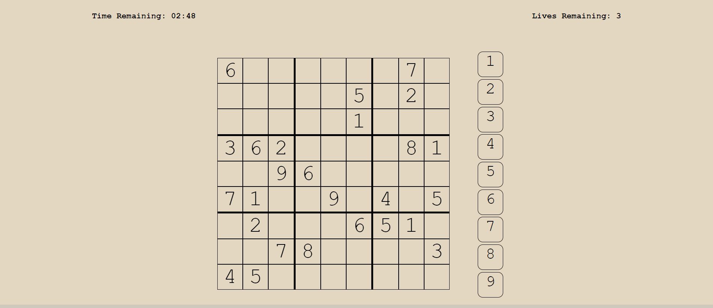
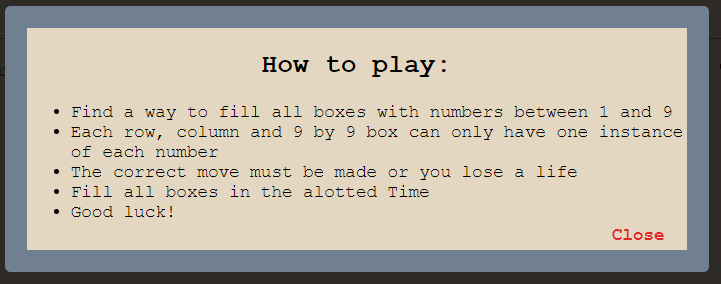
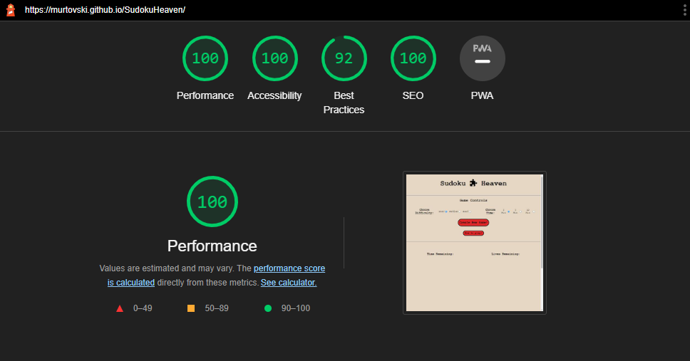

# Sudoku Heaven

## Link to deployed site: https://murtovski.github.io/SudokuHeaven/

### A website for a Sudoku game for users to play for fun

## Table of Contents

1. [Project Goals](#project-goals)
    - [User Goals](#user-goals)
    - [Site Owner Goals](#site-owner-goals)
2. [User Experience](#user-experience)
    - [Target Audience](#target-audience)
    - [User Stories](#user-stories)
3. [User Interface](#user-interface)
    - [Design Philosophy](#design-philosophy)
    - [Colors](#colors)
    - [Fonts](#fonts)
    - [Wireframes](#wireframes)
4. [Features](#features)
    - [Main Page](#main-page)
5. [Validation](#validation)
    - [HTML Validation](#html-validation)
    - [CSS Validation](#css-validation)
6. [Testing](#testing)
    - [Performance](#performance)
    - [Device Testing](#device-testing)
    - [Browser Compatibility](#browser-compatability)
    - [Testing User Stories](#testing-user-stories)
7. [Bugs](#bugs)
8. [Future Updates](#future-updates)
9. [Deployment](#deployment)
10. [Technologies Used](#technologies-used)
    - [Languages](#languages)
11. [Credits](#credits)

## Project Goals

The aim of this project was to create a game that involves an element of chance. The aim is to design a simple page with a clear set of instructions for
the user to follow and to enjoy a game of sudoku. 
This page is to be created to a standard of acceptability for my second code institute project, which includes a high standard of user accessibility,
design and high functionality.

### User Goals

- Play a fun game of sudoku
- Engage their minds with a maths puzzle
- Challenge themselves with a higher difficulty or lower amount of time
- Use an easily navigated and accessible page to enjoy themselves

### Site Owner Goals

- Provide a platform that can be expanded on in the future
- Provide a fun and clear experience for the user
- Provide a free puzzle game to help engage the users mind
- Give the user a challenging game with the option of a more relaxed puzzle experience
- Create a page with hight functionality using html, css and javasript
- Make the website responsive for mobile devices for easy on-the-go gaming

[Back to Top &uarr;](#sudoku-heaven)

## User Experience 

### Target Audience

- People who want to easily engage in a puzzle
- People who enjoy maths or paper puzzles
- People who like to use their mobile devices to play sudoku
- People who want a free gaming experience
- People who are looking for a challenging puzzle

### User Stories

#### First Time Visitors

1. As a first-time visitor, I want to easily understand the aim of this page
2. As a first-time visitor, I want to easily navigate the page to create a sudoku game

#### Returning Visitors

3. As a returning visitor, I want to challenge myself with some tougher difficulties
4. As a returning visitor, I want to engage in different puzzles
5. As a returning visitor, I want to easily access my favourite game on my mobile device

#### Site Owner

6. As the site owner, I want to allow access to a game of sudoku as easily as possible
7. As the site owner, I want users to be able to navigate the website smoothly and easily
8. As the site owner, I want to give a variety of difficulty setting for the users
9. As the site owner, I want to allow for the possibility of expansion of the sudoku games

[Back to Top &uarr;](#sudoku-heaven)

## User Interface

### Design Philosophy

My idea for a sudoku design came from a puzzle game that my grandmother enjoys playing. I thought it would be an interesting way to design a page and figuring out how to actually build the game board. I wanted a single page site, that is easy to navigate and the main focus is the game controls and the game board itself. The real challenge would be the functionality provided by the javascript. Originally I had planned to use nested divs to create the game board, but after researching some tutorials and ideas, I decided that I would use javascript loops to build 'new games' every time the control panel button was pressed.

The header is a simple logo and title. I found a cool font that suited the style I was looking for, which is typewriter-like. It reminded me of the fonts used in my grandmother's puzzle book.

For responsiveness, I simply scaled down the game board size to allow for gaming on smaller viewports.

### Colors 

I used a rgb value for the background color of the entire page. I wanted an off-white color that would almost look like the color of an old newspaper where you would find a game of sudoku. The font color is black like standard ink that would be used to print the paper, the only real stand-out colors used are red coloring for the 'new game' button and the flashing text that appears when it is pressed. I used the red coloring to make it clear to the user that the game is on!

### Fonts

The font that was used for the entire page is the 'Courier New' font style. It did not need to be downloaded or added from google fonts. I chose this font because it gave me the feeling that it had been typed on a newspaper or puzzle book, so I felt like it fitted right in with the design. It is an added bonus that the font did not need additional code to use.

[Back to top &uarr;]

## Features

### Main Page

The header of the page shows the page title and logo let the user know what the page is all about. There is no navigation bar added to the header. I wanted this page to be all about the game board and the game of sudoku itself. The header consists of a the title of the page along with a puzzle piece logo icon.

The footer is a sign off for the game, again I designed the page to show and play a game of sudoku and wanted to display a simple and easy design for the user.

As with all websites, this one also has a favicon that is displayed beside the title of the page. I used a simple puzzle piece to add to the theme of the site.

The game controls contain the different elements to control the difficulty and duration of the game. There are 3 difficulties starting at easy and 3 time settings to give the user a better chance to complete the game. I created two buttons, a start button to create a new board depending on the difficulty of the game. When this button is pressed, "new game" will flash on the board to show the user the board has been set. There is also a help button that will display a window with rules for sudoku and how to play. This can then be closed to continue the game.

The game board is created completely through the Javascript working behind the scenes. Once the start button has been pressed, a function is called where the board is cleared, if one exists, and a new board is created using a for loop. It loops 81 times, filling certain tiles with numbers depending on the difficulty and assigning each tile an id. The game board responds to a hover, and will allow only one number as a correct answer. If the answer is incorrect then the lives remaining counter will drop. The number indicating bar on the right is used to fill the fields of the game board. Once the game ends, the javascript will disable all further moves until andother game is started.

For any user that is new to sudoku, I added a help window to give an outline of the rules for the game. This window has a close button that will exit the window once the user is finished reading.

[Back to top &uarr;](#sudoku-heaven)

## Validation

### HTML Validation

[W3C Markup Validation Service](assets/images/html-validator.png) was used to validate HTML code. One warning persisted, it advised to use a heading for the section that would contain the game board, I decided that it does not need a heading.

### CSS Validation

[W3C CSS Validation Service](assets/images/css-validator.png) was used to validate CSS code. No errors were found. 

[Back to top &uarr;](#sudoku-heaven)

## Testing

### Performance

Google Lighthouse was used to assess the performance of the webpage. Initially it scored an 84 in accessibility, on inspection I found a missing label for a radio button so I rectified that. There was also a deduction for not using a descending system for a heading tag that was used.

The results can be seen below.

### Device Testing

The website was tested with many different sizes according to the web editor on google chrome. The game was designed to scale to a smaller size depending on the screen width. The site responds well to the different sizes.

### Browser Compatibility

- Mozilla Firefox
- Google Chrome

### Testing User Stories

1. As a first-time visitor, I want to easily understand the aim of this page. I believe the page is absolutely clear in its function and goal of playing sudoku. There does not need to be a huge introduction because sudoku is such a widely known puzzle game and can be played anywhere.

2. As a first-time visitor, I want to easily navigate the page to create a sudoku game. The site is designed to instantly recognise where the game is started. It is a single page website that contains all of the features for the game. The interactive controls are colored red for ease of recognition so the site is easily navigated.

3. As a returning visitor, I want to engage in different puzzles. I think there is room to expand the amount of potential puzzles that can be used on the site. There are different difficulty levels and different time settings, however, there is only one key and answer array for each difficulty. With improvement and expansion of the site i could add far more puzzles to each difficulty level and add more ways to complete the puzzle.

4. As a returning visitor, I want to easily access my favourite game on my mobile device. The game is responsive, all the way down to a small device screen and can be played at all of the sizes. The tiles do get small when the game board is scaled down fully.

5. As a returning visitor, I want to challenge myself with some tougher difficulties. Even on easy mode, this game is hard to complete. It involves trial and error because there is only one correct answer to every tile so it can become frustrating and daunting but with persistance and a quick hand, it can be completed.

[Back to top &uarr;](#sudoku-heaven)

## Bugs

1. There were some bugs during deployment involving navigating the file system. It was found and the issue was fixed.

2. There were many bugs during the creation of the javascript, all due to minor typos that had to be ran through and fixed.

[Back to top &uarr;](#sudoku-heaven)

## Future Updates

1. I would like to create a bigger database containing many different instances of sudoku games.

2. I would try to adjust the code so a life would not be lost if a correct move had been made but would not work for the final solution.

3. In the future I would even like to add a crossword game of similiar design to an extra page so the user had more variety.

## Deployment

This project was deployed to GitHub Pages using the following steps:

1. Log in to GitHub.
2. Navigate to settings tab and select pages.
3. Select "Source" and select "main".
4. Click Save
5. The page will then automatically refresh.
6. After a while a link will generate with the deployed page.

[Back to top &uarr;](#sudoku-heaven)

## Technologies Used

### Languages

- HTML 5
- CSS 3
- JavaScript

## Credits

1. [YouTube] - (https://www.youtube.com/c/KennyYipCoding) - I took inspiration fot the design of the Javascript code from a tutorial and explanation from this creator.
2. [Code Institute Template](https://github.com/Code-Institute-Org/gitpod-full-template) - This project was first based off the repository created by Code Institute. This template made it very easy to work with in GitPod.
3. [Stack Overflow](https://stackoverflow.com/) & [W3Schools](https://www.w3schools.com/) - These two website were instrumental in me furthering my understanding of HTML and CSS.
4. [Code Institute](https://codeinstitute.net/ie/) - Last but certainly not least, this project wouldn't have been possible without the course and material presented there.
5. [Ryael](https://github.com/Ryael/victory-fitness) - I took alot of advice from a classmates extraordinary work for the ReadMe file and how to create a detailed account of the project. My previous project had been lacking in detail.